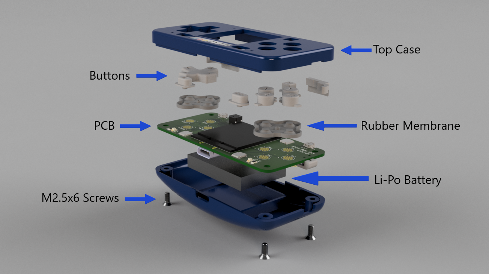
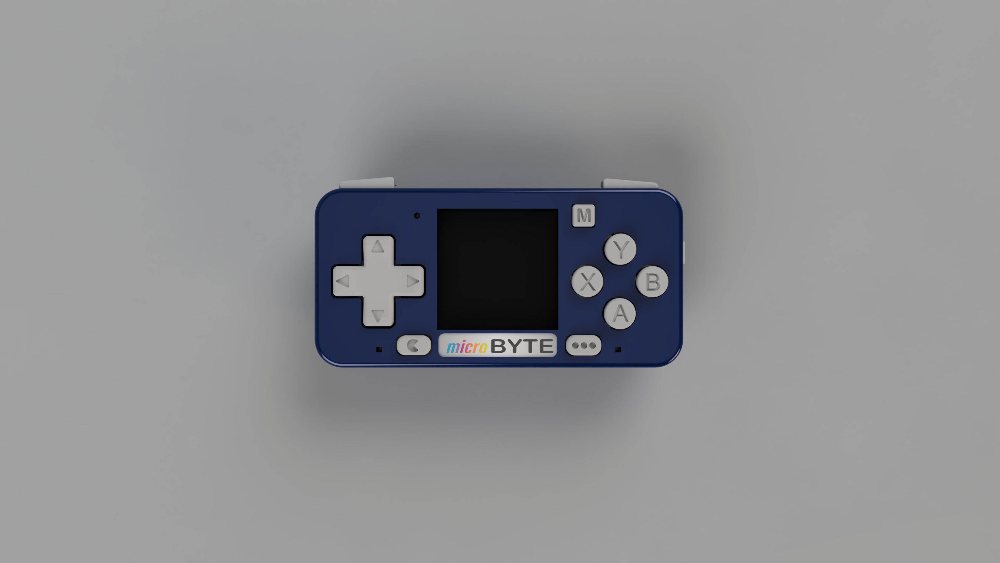
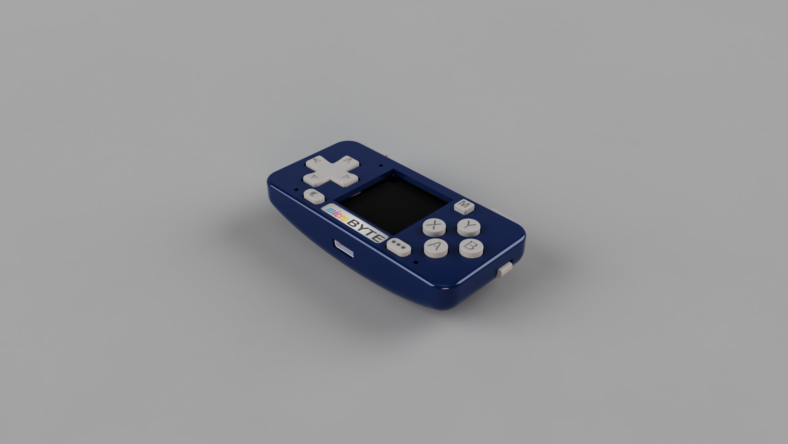

In this repository you can find the STL files to 3D print your custom microByte case.
The case is split in 3 different block:

- Top case.
- Bottoom case.
- Buttons pack.

All the of theses are designed to be easily 3D printed on FDM or Resin 3D printers.

**In a future update I'll upload the settings to print properly.**

The next images are render of the case structure.

## Disassembly

## Top View

## Perspsective

